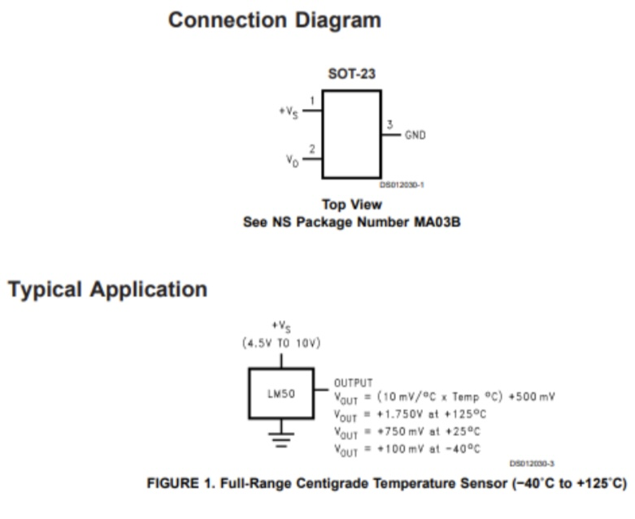
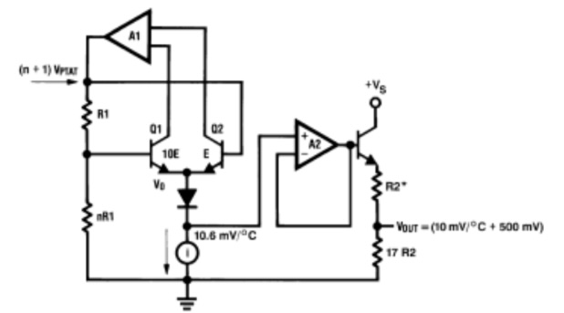

# LM50_Sensor
Design of a **LSTM** sensor which measures the temperature between -20 to 60 degrees with highest resolution.
 
The top level design of a LSTM sensor is as follows:
 

 

  
By refering to the datasheet, we can see that the input value range for this sensor is between **-40 to 125** centigrades, and for voltage range of **4.5 to 10** volts. We can also see that the equation corresponding to the output of this sensor is as follows:
 

 
By using the equation above, and using a **STM32 micro-controller**, I wrote a program to measure the temperature with the sensor. The measured temperature is later printed on an lcd display connected to the STM32 microcontroller.
